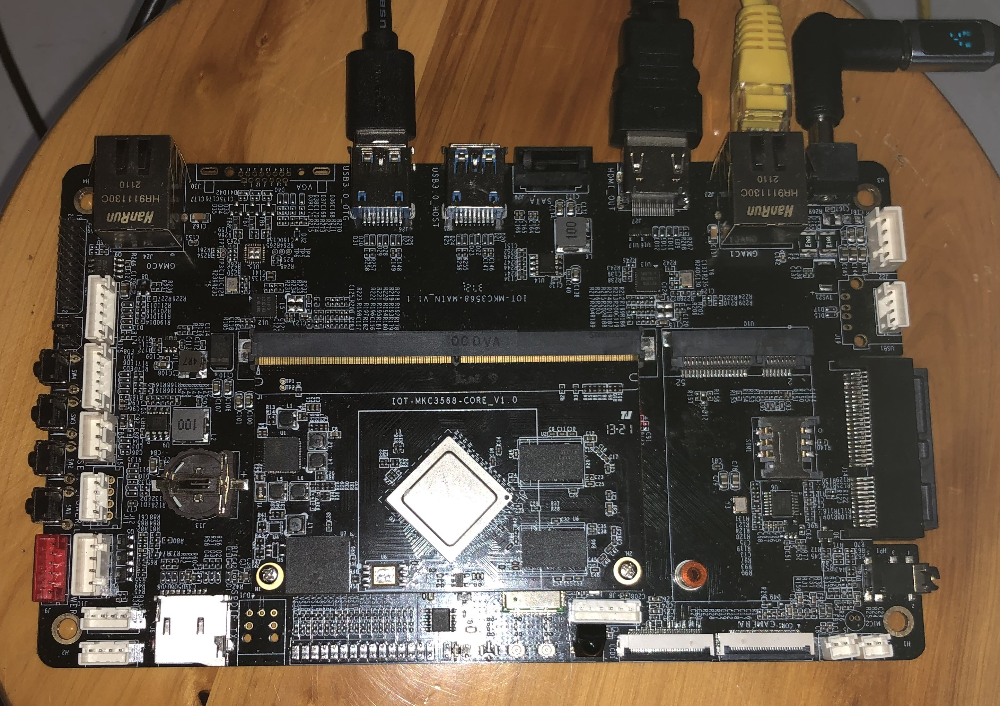

# 明控创能 IOT-MKC3568 开发板系统移植项目

[](https://github.com/YOUR_NAME/dutyc/IOT-MKC3568-OS-Porting)
[](https://www.gnu.org/licenses/gpl-3.0)

**语言**: [English](README_en.md) | 简体中文

##  项目概述
本项目旨在为 **明控创能 IOT-MKC3568-Main-v1.1** 开发板（基于 Rockchip RK3568）移植主线 Ubuntu/Debian 系统。该开发板无官方资料，属于完全的硬件逆向与驱动适配工程。

**项目状态**: 进行中 - **Phase 2: 解决烧录通道**
**最终目标**: 提供可稳定启动和运行的 Linux 系统镜像及完整构建方法。

##  硬件规格
| 组件     | 规格                               | 状态                  |
| :------- | :--------------------------------- | :-------------------- |
| **SoC**  | Rockchip RK3568                    | 已验证                |
| **RAM**  | 2GB DDR4 (4x512MB Samsung)         | 已验证                |
| **存储** | 32GB eMMC                          | 已验证，已备份        |
| **网络** | 2x GbE (1口异常)                   | 已验证                |
| **USB**  | 1x Host, 1x OTG (故障)             | **OTG为当前主要障碍** |
| **其他** | Wi-Fi 5, HDMI, 2x SATA, 未标注排针 | 待驱动                |




## 当前进度与挑战

###  已完成
- 串口调试环境搭建
- ADB over TCP 开机自启动配置
- 完整 eMMC 镜像备份 (`dd if=/dev/block/mmcblk2`)
- `boot.img` 解包，确认 DTB 为 `rk3568-evb1-v10`

###  核心挑战（急需帮助！）
1.  **烧录通道缺失**: USB-OTG硬件故障，无法进入Maskrom/Loader模式。
2.  **U-Boot不稳定**: 板载U-Boot执行基础命令即崩溃，无法用于引导新系统。
3.  **硬件接口未知**: 板载多组未标注排针，功能不明。

**详细技术瓶颈与求助方向请参见**：[GitHub Issues #1](./issues/)

##  仓库目录结构

```
IOT-MKC3568-OS-Porting/
│  LICENSE
│  README.md
├─assets
│      IMG_4291.JPG
├─links
│      dev_file-links.md
├─docs
│      Analysis report.md
│      RK_EVB1_RK3568_DDR4P216SD6_V10_20200908.pdf
│      start info.txt
│      u-boot-info.txt
├─firmware
│  └─extracted
│          bootimg_contents.md
│          dtb.0.dts
└─hardware
    └─photos
            IMG_4206.JPG
            IMG_4207.JPG
            ......
```


## 快速文件导航
- **硬件照片**：[`/hardware/photos/`](./hardware/photos/) - 板卡高清图
- **UBoot分析**：[`/docs/u-boot-info.txt`](./docs/u-boot-info.txt) - 初步分析结果
- **设备树源文件**：[`/firmware/extracted/dtb.0.dts`](./firmware/extracted/dtb.0.dts) - 反编译的硬件定义
- **原始镜像**：[`/links/dev_file-links.md`](./links/dev_file-links.md) - 备份文件以及解包后的boot.img下载链接


## 🛠 如何使用本仓库

1.  **对于观察者/协作者**：请关注 [Issues](https://github.com/YOUR_NAME/REPO_NAME/issues) 和 [Discussions](https://github.com/YOUR_NAME/REPO_NAME/discussions) 了解最新动态和求助问题。
2.  **对于开发者**：欢迎 Fork 并提交 PR。建议从标注有 `help-wanted` 的 Issue 开始。

##  如何参与贡献
我们急需以下方向的帮助：
- **Rockchip RK3568 启动流程与刷机绕过方案**
- **U-Boot 移植与调试经验**
- **硬件逆向与接口探测**
- **Linux 内核驱动适配**

参与方式：
1.  在 [Issues](./issues) 中分享你的想法。
2.  提交 Pull Request 修复文档或提供脚本。
3.  在 [Discussions](./discussions) 中参与技术讨论。

##  许可证
本项目文档部分采用 [CC BY-SA 4.0](LICENSE_DOC) 许可证，代码部分采用 [GPLv3](LICENSE) 许可证。详情请见许可证文件。

##  联系与外部链接
- **项目维护者**: [dutyc (LECREATE)](https://github.com/dutyc)

- **详细技术博客记录**: [明控创能 IOT-MKC3568 开发板系统移植全记录 - DUTYC博客](https://blog.dutyc.top/2026/01/11/2026011101/)

- **相关社区提问**:
    - [寻求 IOT-MKC3568-Main-v1.1 (基于 EVB1-V10) 开发板的移植帮助 - Neardi 开源论坛](https://forum.neardi.com/d/196-xun-qiu-iot-mkc3568-main-v11-ji-yu-evb1-v10-kai-fa-ban-de-yi-zhi-bang-zhu)
    
      
